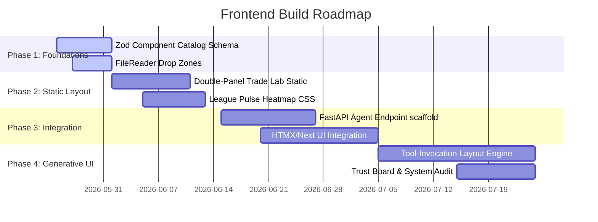

# Product Manager Recommendation: Dynasty Genius Frontend UI/UX Architecture

**Document Type:** Strategic Frontend Product Specification  
**Author:** Gemini (Product Manager)  
**Status:** Under Review (Independent Agent Phase)  
**Authority:** PM Oversight (Read-Only Blueprint)  
**Version:** 1.0.0  
**Grounded in:** `00-product-constitution.md`, `01-north-star-architecture.md`, `02-agent-operating-loop.md`, `03-code-hygiene-policy.md`

---

## 1. Executive Summary & PM Vision

Dynasty Genius is a personal analytical laboratory designed for one user (David) to make high-stakes dynasty decisions in a 12-team Superflex PPR league. It is **not** a public SaaS tool, a mobile app, or a social network. The interface must respect this singular mission, prioritizing **dense, calm, expert-grade data visualization** over gamified simplified scores, consensus heatmaps, or misleading binary verdicts.

The core frontend vision is the **"Honest Terminal"**—a cockpit-style workspace that treats uncertainty as a first-class citizen, strictly isolates proprietary machine-learning projections from raw market consensus, and enforces zero-leakage governance bounds.

```
+-------------------------------------------------------------------+
|                           APP SHELL                               |
|  +-------------------------------------------------------------+  |
|  | Persistent Left Rail Navigation                             |  |
|  | [Home] [Roster] [Rookies] [Players] [Trade Lab] [League]...   |  |
|  +-------------------------------------------------------------+  |
|  | Sticky Top Status Strip (Freshness, decision_supported: F)  |  |
|  +-------------------------------------------------------------+  |
|  |                                                             |  |
|  |  +------------------------+     +------------------------+  |  |
|  |  |   MODEL LANE (Indigo)  |     |  MARKET LANE (Amethyst)|  |  |
|  |  |  xVAR, DVS, Projections|     |  KTC, FantasyCalc, ADP |  |  |
|  |  +------------------------+     +------------------------+  |  |
|  |              \                        /                     |  |
|  |               \                      /                      |  |
|  |                ▼                    ▼                       |  |
|  |            +----------------------------+                   |  |
|  |            |   Divergence Context       |                   |  |
|  |            |   (Shaded Uncertainty Band)|                   |  |
|  |            +----------------------------+                   |  |
|  |                                                             |  |
|  +-------------------------------------------------------------+  |
|  | Collapsible Right-Rail Inspector (No-Nav Detail Inspection) |  |
|  +-------------------------------------------------------------+  |
+-------------------------------------------------------------------+
```

---

## 2. Product Philosophy & UX Principles

### 2.1 The "Honest Terminal" Concept
Where competitor platforms offer binary action alerts ("Buy Now", "Verdict: Strong Win"), Dynasty Genius presents objective evidence. The system acts as an advisory canvas, mapping multi-layered indicators (draft capital, aging trajectories, usage shares) and surfacing **divergence**, leaving final strategic rulings entirely to David.

### 2.2 Strict Visual Lane Separation
Proprietary predictive outputs (Engine B `xVAR`, `DVS`, `projection_1y/2y/3y`) and crowdsourced market pricing (FantasyCalc, KTC, ADP) must never be averaged, merged, or combined into composite scores. They exist in physically and visually segregated tracks:
* **The Model Lane (Cool Blue - Indigo `#4F46E5`):** Monospace/slab-serif digits displaying proprietary machine-learning projections.
* **The Market Lane (Warm Amber - Amethyst `#9333EA` / Sage `#10B981`):** Tabular sans-serif digits displaying raw consensus price discovery.
* **The Divergence Overlay:** A third, neutral visual lane (Gold `#F59E0B`) that maps the mathematical variance between model and market, showing the gap without labeling it as "undervalued" or "overvalued."

### 2.3 Uncertainty as a First-Class Citizen
Valuation numbers must never imply false certainty. The UI incorporates:
1. **Morningstar-Style Shaded Bands:** In line-charts and scatterplots, the thickness of a shaded band surrounding the model value represents the variance or uncertainty interval (the wider the band, the higher the uncertainty).
2. **Clinical XAI Counter-Evidence:** In compliance with advanced explainable AI design patterns, every player detail card must dedicate a physical panel to **Counter-Arguments** (1–3 concrete historical or usage-based reasons why the model's projection could fail) and **Evidence Gaps** (e.g. "PFF college route grades missing for weeks 1–4").
3. **De-saturation of Experimental Elements:** Any view displaying experimental models, unverified identity matches, or stale snapshots is visually de-saturated, conveying lower trust states.

### 2.4 Banned vs. Recommended Vocabulary
Linguistic guardrails are enforced on all surfaces to maintain objective, advisory posture:

| Banned (Imposes False Certainty) | Recommended (Presents Objective Context) |
| :--- | :--- |
| "Buy Now" / "Sell Now" | "Value Surplus: +18% over Market" |
| "Accept Trade" / "Reject Trade" | "Roster Capacity: -1 Spot; Net xVAR: +1.4" |
| "Bust Prospect" | "High Variance (Bottom 10th Percentile Floor)" |
| "Verdict: Win" / "Verdict: Loss" | "Divergence Signal: Inside Band" |
| "Target this Player" | "Positional Deficit: WR room under-capacitized" |

---

## 3. App Architecture & Tech Stack

### 3.1 The Framework Decision: Next.js + Vercel AI SDK (UI Mode)
To support rich, interactive data density alongside streamable Generative UI, we recommend:
* **Frontend Framework:** **Next.js (App Router)** as the thin presentation shell.
* **Orchestration Layer:** **Vercel AI SDK (UI Mode)**, utilizing `useChat` and client-side component mapping over raw text tool invocations.
* **Aesthetics & Components:** **shadcn/ui** and **Radix Primitives** for WCAG 2.1 AA accessible, clean, and highly polished terminal layouts.
* **Styling:** **Vanilla Tailwind CSS** for modular token implementation.

> [!WARNING]
> **Vercel AI SDK RSC is paused.** In compliance with Vercel's official announcements, the Next.js App Router setup should avoid `streamUI` / React Server Components (RSC) for streaming interfaces. Instead, the orchestrator must use `streamText` returning structured JSON layouts that map to a static client component catalog. This is faster, highly deterministic, and immune to stochastic JSX compilation errors.

### 3.2 The Data Substrate: DuckDB + Local Parquet
To maintain single-user zero-latency performance without high cloud infrastructure costs, we reject complex remote databases or Databricks workspaces.
* **Analytical Engine:** **DuckDB** executing local queries in the presentation layer.
* **Data Storage:** Pinned **Parquet files** on disk partitioned by source and date.
* **Relational Store:** **SQLite** (or a local **Postgres** instance) reserved exclusively for mutable session data (chat history, saved layouts, manually resolved overrides).

```
~/dynasty-genius/data/
├── raw/                      # Immutable snapshots of Sleeper/FantasyCalc
├── silver/                   # Cleaned, canonicalized Parquet (nflverse, PFF)
└── gold/                     # Feature-engineered Parquet (Engine A, Engine B, xVAR)
```

> [!IMPORTANT]
> **Databricks Cost Bypass:** A remote Databricks Premium workspace costs between $2,000–$5,000/month in compute and license fees. For a single-user dataset (~10 GB of total historical nflverse, Sleeper, and market tables), local DuckDB is 16–26x faster than standard SQL engines, consumes zero budget, and allows fully sandboxed local-first execution.

### 3.3 Generative UI Stance: Component Layout Mapping
Generative UI is highly valuable when the *shape* of the analytical answer depends on the question (e.g. trade evaluation, 3-year position group simulations, what-if injury branching). It must follow **Pattern A (JSON Layout Spec)**:
1. The user asks a question in the command console.
2. The orchestrator calls Claude Sonnet 4.6, prompting it to select and compose components from a closed catalog.
3. Sonnet emits a strictly structured JSON tool invocation representing the layout:
   ```json
   {
     "component": "PositionGroupTimeline",
     "props": { "position": "RB", "years": [2026, 2027, 2028] }
   }
   ```
4. The React client parses the JSON layout and mounts the registered, type-safe components.
5. Skeletons render immediately with reserved `min_height` bounds to prevent Cumulative Layout Shift (CLS), populating data once the FastAPI backend resolves the query.

---

## 4. App Shell & Information Architecture

The app shell unifies seven distinct workspaces through a dense, persistent left-rail navigation and a global context header.

```
+--------------------------------------------------------------------------------------+
|  [LEAGUE: Redzone Champions] [POSTURE: Rebuild] [DVS: 64.2] [decision_supported: F]  |
+--------------------------------------------------------------------------------------+
| (Nav)    |  Home / Command Center                                                    |
| [Home]   |  +---------------------------------------------------------------------+  |
| [Roster] |  |  Review Areas (Sorted by Signal Density)                            |  |
| [Rookies]|  |  1. Jefferson (Model > Market +18% | Uncertainty: Wide)             |  |
| [Players]|  |  2. Brooks (Rookie Rank Shift: +14 | Pre-draft)                     |  |
| [Trade]  |  +---------------------------------------------------------------------+  |
| [League] |  |  Roster Pressure     |  Trust & Freshness                           |  |
| [Trust]  |  |  Cap: 28/28          |  Sleeper Sync: 5m ago  | PFF: Fresh          |  |
| [Config] |  +---------------------------------------------------------------------+  |
+--------------------------------------------------------------------------------------+
```

### 4.1 Persistent Top Status Strip
A 24px global header bar visible on all screens:
* Active league, roster size, and current posture (e.g. "Woodbury Riders | Rebuild").
* System freshness indicators (oldest active data source age).
* A highly visible, non-dismissible tag: `decision_supported: false` (coerced at the database and API schema levels).

### 4.2 Keyboard-First Command Bar (Cmd-K)
A global overlay modal inspired by Bloomberg and Raycast. David can jump to any player, league-mate roster, or workspace page by pressing `Cmd-K` and typing a keyboard shortcut (e.g., `/trade`, `/prospect Brooks`, `/roster`).

### 4.3 Collapsible Right-Rail Inspector Panel
Clicking any player or draft asset anywhere in the application slides open a persistent right-rail detail panel (similar to Palantir Foundry). This allows David to check age curves, projected target shares, or market overlays instantly without navigating away from his current workspace.

---

## 5. Detailed Page and Decision Surfaces Specification

### 5.1 Home / Command Center
The landing screen that summarizes system alerts, freshness, and outstanding review areas. It contains four high-density widgets:
1. **Today's Review Areas (8 Columns):** A flat list of players showing anomalous divergence or recent rank movements. Crucially, this list is **sorted by a composite Signal Density Score** (the mathematical concentration of model-to-market variance, age-cliff warnings, and recent usage trends)—never by projected profit.
2. **Roster Pressure Snapshot (4 Columns):** Horizontal capacity gauges showing current roster filling vs. taxi/IR caps, with a warning flag indicating the number of forced-cut candidates that will form if rookies are added.
3. **Recently Changed Signals (6 Columns):** A small-multiples grid of 12 sparklines mapping the last 14 days of active player PVO trends and KTC deltas.
4. **Trust & Freshness Index (6 Columns):** Compact tables showing exactly when each adapter last pulled data, highlighting stale files in amber.

### 5.2 Roster Audit
Designed to analyze David's portfolio and identify biological debt.

```
+--------------------------------------------------------------------------------------+
| Roster Audit -- Woodbury Riders (Rebuild Stance)                                     |
+--------------------------------------------------------------------------------------+
| Player          | Model Lane (Cool blue)      | Market Lane (Warm amethyst) | Diverg |
|-----------------|-----------------------------|-----------------------------|--------|
| J. Jefferson    | PVO: 92.4  | xVAR: +8.4     | KTC: 7890 | DLF: WR1        | +12%   |
| J. Brooks       | PVO: 64.2  | xVAR: +2.1     | KTC: 4210 | DLF: RB16       | +18%   |
+--------------------------------------------------------------------------------------+
| Biological Debt Scatterplot                  | Capacity Pressure                    |
| x=Age, y=xVAR. Dashed lines=peak age curve   | Starters: [█████████░░░] Cap: 28     |
| [QB Peak: 26-30] [RB Peak: 25-27 (Cliff: 28)]| Taxi:     [██████░░░░░░] (Warning)   |
+--------------------------------------------------------------------------------------+
```

* **The Roster Table:** Includes dense columns grouping Model metrics (PVO, xVAR) on the left (thin cool-blue border) and Market metrics (KTC, DLF rank, ADP) on the right (thin warm-purple border). Value divergence displays as a neutral percentage variance.
* **Biological Debt Scatterplot:** A 2D visualization plotting player age vs. xVAR. A dashed line overlay shows the position-specific peak curve derived from historical data (RB peak 25–27 with cliff at 28, WR peak 26–30 with cliff at 31). A shaded vertical bar clearly marks the age-cliff warning zones.
* **Forced-Cut Pressure List:** Lists active roster assets sorted strictly by lowest model-value-per-roster-slot, providing clear context on who to drop when roster caps are exceeded.

### 5.3 Rookie Board
Supports rookie draft pick decisions by integrating pre-draft profiles, draft capital, and live draft states.
* **Projections & Draft Capital:** Displays Engine A prospect ranks, draft capital metrics, college dominator scores, and breakout ages, alongside KTC consensus.
* **Interactive Live Draft State:** If a rookie draft is active, the table visually de-emphasizes taken players (50% opacity with a strikethrough) rather than removing them. David can see who has been selected, who remains, and who represents the highest model-to-market divergence available at his current pick slot.

### 5.4 Trade Lab
A three-column workspace allowing the evaluation of complex, multi-asset trades.

```
+--------------------------------------------------------------------------------------+
|  Trade Lab (Hypothetical Construction)                     decision_supported: false |
+--------------------------------------------------------------------------------------+
|  SIDE A (Gives)            |  ANALYSIS PANE (Advisory)      |  SIDE B (Gives)            |
|  - 2027 1st Round Pick     |  +---------------------------+ |  - C. McCaffrey (RB, 29.8) |
|  - J. Cook (RB, 25.6)      |  | Model Value Net: +1.4 xVAR| |                            |
|                            |  | Market Value Net: -240 FC | |                            |
|                            |  +---------------------------+ |                            |
|                            |  | Roster Cost: -1 Roster Spot| |                            |
|                            |  | Roster Cuts Required: None | |                            |
|                            |  +---------------------------+ |                            |
|                            |  | Realism Warning: Diluted   | |                            |
|                            |  +---------------------------+ |                            |
+--------------------------------------------------------------------------------------+
```

* **Left & Right Panes:** Structural lists of assets being traded.
* **Center Analysis Pane:** Maps the four-layered analytical engine:
  1. **Model View:** Side A vs. Side B net xVAR totals represented as horizontal bars, showing the net gain or loss in WR-equivalent points.
  2. **Market View:** Side A vs. Side B net FantasyCalc/KTC values represented as adjacent bars.
  3. **Roster Capacity Cost:** Computes if the trade causes roster overflow, identifying if a forced-cut penalty must be subtracted from the incoming model value.
  4. **Competitive Realism Warnings:** Fires warnings if the package represents high dilution (e.g. trading premium assets for three roster-filling bench players).

### 5.5 League Opportunity Map
A 12-column dashboard mapping the rosters, posture, and surplus/deficits of all league-mates. Clicking a team highlights trading opportunities where David's positional surplus matches the target team's deficit.

### 5.6 Trust & Governance Board
The transparency core of the system. Displays the active version of all models (Engine A, Engine B, xVAR calibration), the exact code commit, data lineage dependencies, and the raw age of all local snapshots.

---

## 6. Information Flow & Context Engine

### 6.1 System Prompt Context Engineering
To maintain conversational coherence and prevent hallucinations, the middleware generates a structured `LeagueContext` block injected as an XML-tagged header in the system prompt. In compliance with Anthropic context engineering best practices, this block curates high-signal tokens to guide layout generation:

```xml
<system_context>
  <league_format>12-team Superflex PPR, no TEP</league_format>
  <user_roster_id>1</user_roster_id>
  <user_stance>Rebuild</user_stance>
  <aging_cliffs>QB:33, RB:26, WR:28, TE:30</aging_cliffs>
  <roster_composition>
    <player id="13414" name="Kaelon Black" age="23.2" pvo="41.2" xvar="0.00" />
    <!-- complete active roster list -->
  </roster_composition>
</system_context>
```

### 6.2 Ephemeral Prompt Caching
This `LeagueContext` is stable across a session. We recommend utilizing **Anthropic Ephemeral Prompt Caching (5-minute TTL)**. By structuring the system prompt as a cached prefix, subsequent user queries in the same session bypass full token parsing.
* **Base Input Cost:** $3.00/MTok.
* **Cache Read Cost:** $0.30/MTok (90% discount).
* At 30 queries per day, clustered in 6 active sessions, caching limits the marginal LLM spend to **$30–$55/month**, ensuring high-quality Sonnet 4.6 usage stays highly economical.

### 6.3 Fallback and Error Handling
If a tool invocation fails, or if a model-native call exceeds a hard **3.0-second timeout limit**, the client-side renderer swaps the affected layout node to a default fallback component (e.g., standard `PlayerCard` or markdown text). The layout engine suspends the broken component without freezing or crashing the global App Shell.

---

## 7. Phased Build Roadmap

We propose a four-stage, disciplined frontend roadmap, aligned with existing backend database and engine work:



### Phase 1: Foundations & Parser Layer (Current Sprint)
* Define the atomic component Zod schema catalog in Next.js.
* Stand up the HTML5 `FileReader` drag-and-drop zone to load local Sleeper/FantasyCalc JSON files directly into document memory, bypassing origin-security controls.
* Implement the abstract Local Storage Driver with automatic in-memory fallbacks.

### Phase 2: Static Layout & Visual Tokens (Next Sprint)
* Define the HSL design tokens, CSS custom variables, and layout frameworks.
* Implement the static, double-panel Trade Lab layout, verifying CSS borders, typography, and clear indigo/amethyst track separation.
* Build the responsive 12x12 CSS Grid for the League Pulse opportunity heatmap.

### Phase 3: Dynamic Integration & Models
* Wire the static Next.js views to local FastAPI server endpoints via JSON-over-HTTP.
* Implement the SVG capacity gauges and positional age-cliff step functions.
* Wire the Roster Audit and Trade Lab to live, cached model datasets (`universe_pvo_latest.json`).

### Phase 4: Generative UI Activation
* Stand up the FastAPI `/agent` endpoint mapping to Claude Sonnet 4.6.
* Implement the JSON-layout parsing engine in React, rendering progressive components.
* Build the Trust & fresh-check dashboards.

---

## 8. Risk Register & Mitigations

* **Risk 1: LLM Hallucinates a Player Score.**
  * *Mitigation:* The LLM has zero exposure to raw computational weights or formula execution. It acts purely as a layout composer. All numeric values (xVAR, DVS, KTC) are fetched directly from validated databases by the Python backend via strictly typed tool calls. The Zod layout schema restricts player fields to a closed list of verified `player_id` keys, preventing naming hallucinations.
* **Risk 2: Cumulative Layout Shift (CLS) during streaming.**
  * *Mitigation:* Every registered component in the Zod catalog defines a strict, breakpoint-specific `min_height` prop. The layout renderer mounts standard HTML skeleton states with matching heights before streaming begins, ensuring zero shifting as data populates.
* **Risk 3: Access and Origin Blocks under `file://` protocol.**
  * *Mitigation:* The application completely avoids local asynchronous `fetch` requests or ES modules that trigger browser CORS sandboxes. All data ingestion is user-initiated via drag-and-drop file inputs using the browser's native `FileReader.readAsText()` API.
* **Risk 4: Cognitive Overload & Verdict Confusion.**
  * *Mitigation:* The UI keeps 60% of all workflows declarative (static tables, roster audits, standings). Generative UI triggers exclusively inside the interactive Command Console. Banned terms are filtered at the output schema layer.
