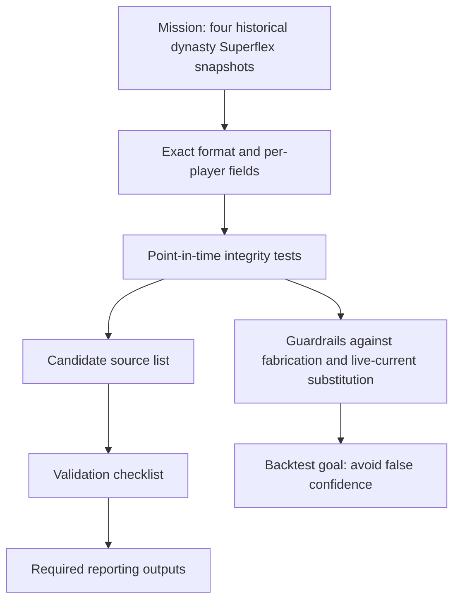

# Analytical Report on the Uploaded Research Brief

## Executive summary

The uploaded document is a tightly scoped research brief for sourcing **point-in-time dynasty Superflex fantasy-football market values** for four historical September dates, with enough provenance to support a backtest of whether a valuation model beat the market *as the market actually existed then*. Its central demand is not merely “historical data,” but **historically faithful data**: the brief explicitly rejects relabeled current values, back-revised numbers, survivorship-scrubbed datasets, fabricated substitutes, and live current-only endpoints; it also treats “not found” as a valid result. fileciteturn0file0

The brief is methodologically strong. It clearly defines the target dates, the acceptable capture window of ±7 days, the league-format requirements, the preferred and fallback source families, the minimum output schema, the anti-contamination integrity checks, and the reporting package expected from the final researcher. It is best understood as a **pre-registered source-validation protocol** for a backtest, not just a generic data-hunting memo. fileciteturn0file0

The most important issue revealed by external verification is a **format-and-licensing tension** the brief does not fully resolve. The brief requires **12-team, Superflex, PPR=1** data, yet one of its named fallbacks, KeepTradeCut, officially states that its dynasty values are built on a **12-team, .5 PPR** baseline, and KTC also states that it has **no API or CSV export** and that scraping full rankings/value data is expressly forbidden. By contrast, the strongest publicly verifiable lead in this review is the DynastyProcess GitHub repository, which is public, GPL-3.0 licensed, contains values files and a player-IDs file, and has timestamped file-history pages; however, the date span I could directly verify in this review only reached into **2025–2026**, not the target September windows in **2021–2024**. citeturn39view3turn39view4turn40view0turn40view1turn39view0turn39view1turn9view1turn39view2

**Main findings**

- The brief’s strongest feature is its insistence on **point-in-time integrity**, especially its explicit survivorship-bias test and its rejection of current-only endpoints for historical use. fileciteturn0file0
- The brief is unusually well specified for a data-sourcing memo: it defines date windows, required fields, acceptable source hierarchy, validation criteria, and expected outputs. fileciteturn0file0
- DynastyProcess is the strongest **externally verified public lead** in this review because its official repo is public, GPL-3.0 licensed, updated through GitHub Actions, exposes `values.csv` plus sibling values files, and preserves dated file history. citeturn39view0turn39view1turn39view2
- KeepTradeCut is materially weaker as a fallback than the brief implies because KTC’s official baseline is **12-team, .5 PPR**, not full PPR, and KTC says it has **no API/CSV** and forbids scraping full values. citeturn39view3turn39view4turn40view0turn40view1

**Conclusions**

- The brief is **research-ready in principle** and would be a good operating specification for a disciplined archival search. fileciteturn0file0
- Before execution, it should be tightened on one critical point: whether a **scoring-format mismatch** such as KTC’s .5 PPR baseline is acceptable as a fallback or must be rejected outright. fileciteturn0file0 citeturn39view3turn40view1
- The brief correctly prioritizes **false-positive avoidance** over completeness, which is the right stance for a historical backtest. fileciteturn0file0

**Uncertainties**

- This review did **not** independently verify a public FantasyCalc historical endpoint or four successful archived captures for the target dates. The brief’s preference for FantasyCalc remains a document-level preference, not a verified availability result in this report. fileciteturn0file0
- The exact September **2021, 2022, 2023, and 2024** coverage of DynastyProcess was not confirmed here; only publicly visible recent history was verified. citeturn39view1turn9view1
- The brief allows alternative source IDs when Sleeper IDs are absent, but the exact crosswalk burden is source-dependent and may be nontrivial. fileciteturn0file0 citeturn39view0turn39view2

**Assumptions**

- I treat the uploaded brief as the primary object of analysis, and external sources as verification of its named leads rather than a full execution of the archival search itself. fileciteturn0file0
- I assume the brief’s statement that **a missing date is acceptable but a wrong date is not** is operative and should govern all downstream retrieval choices. fileciteturn0file0
- I assume the brief’s statement that only **within-date ranking** matters operationally is deliberate and important, because it lowers the risk from cross-date scale differences. fileciteturn0file0

**Data gaps**

- No explicit tie-break rule is given for choosing among multiple captures within the ±7-day window. fileciteturn0file0
- No explicit sentinel-player list is supplied for the survivorship test, even though the brief correctly says that such players must appear in genuine historical snapshots. fileciteturn0file0
- The brief requests `updated_at` as an optional but valuable field, yet the currently verified DynastyProcess values file shows a single `scrape_date` rather than a per-row revision timestamp. fileciteturn0file0 citeturn39view2

## What the document requires

The brief is organized as a clear sequence of research controls. It opens by defining the mission: find a **downloadable**, **point-in-time** archive of dynasty Superflex market values for four target dates close to **September 8 of 2021, 2022, 2023, and 2024**, suitable for a backtest of whether a valuation model beat the market over time. It then specifies the exact requested format: **dynasty**, **Superflex / 2-QB**, **12-team**, **PPR**, with one row per player per date and a preference for `sleeper_id`, while still allowing alternative identifiers if they can be cross-walked. It also makes clear that a single consistent source across all dates is preferable, but not mandatory. fileciteturn0file0

The document’s central section is its integrity framework. It requires any candidate source to be evaluated against four hard tests: whether the data are **as-published rather than recomputed**, whether they pass a **survivorship-bias check**, whether the capture date is **intrinsically verifiable** through something like a file date, archived-page capture, or git commit, and whether the source avoids being a **live current endpoint** that cannot actually serve history. This is paired with a candidate-source list led by DynastyProcess, then community GitHub datasets, FantasyCalc, KTC, the Wayback Machine, and community archivists. fileciteturn0file0

The back half of the brief is effectively an audit template. It asks for a ranked shortlist of candidate sources, exact retrieval steps, a 5–10 row sample for each best candidate/date, a coverage map of which dates are obtainable, and an honest statement of risks and gaps. The guardrails are explicit: **no fabrication**, **no imputation**, **no interpolation**, **no substitution of current values**, and no use of sources that fail point-in-time provenance. The reasoning is also explicit: bad historical data would corrupt the backtest and create false confidence about model quality. fileciteturn0file0

The document’s structure can be summarized as follows. fileciteturn0file0

## Assessment of methodological rigor

The brief is strongest where many data-sourcing requests are weakest: it makes the **research failure modes explicit before the search begins**. In particular, it treats historical integrity as the central research object, not a secondary metadata concern. That is methodologically sound. The survivorship test is especially strong, because it directly addresses a common hidden failure mode in sports and financial backtests: “historical” datasets that silently exclude players or assets no longer relevant today. The brief also improves auditability by requiring retrieval steps, sample rows, source ranking, and honest reporting of gaps rather than forcing a false veneer of completeness. fileciteturn0file0

The document is also appropriately conservative about provenance. Its preference for capture dates that are **intrinsic to the source artifact**—such as git commit dates, archived-page timestamps, or dated files—is much stronger than relying on hand-entered labels or verbal claims. Its explicit allowance that “not found” is acceptable is another sign of rigor: it lowers the incentive to overfit weak evidence into a superficially complete answer. fileciteturn0file0

The main weakness is not conceptual but operational: the brief contains an unresolved **format hierarchy problem**. It defines the target format as **PPR=1**, yet one of its named acceptable fallbacks, KTC, officially states that its values are based on a **vanilla 12-team, .5 PPR league**. KTC also states that it does not currently offer an API or CSV export and forbids scraping player values in their entirety. That means KTC is not merely a weaker fallback; it is potentially **out of spec** on both **format** and **retrieval/licensing** grounds unless the brief is amended to allow “closest-available but clearly labeled” substitutes. fileciteturn0file0 citeturn39view3turn39view4turn40view0turn40view1

A second weakness is under-specification of tie-breaking and sentinel checks. The brief allows captures within ±7 days, which is reasonable, but it does not specify what to do if multiple acceptable captures exist inside that window. Nor does it pre-register a benchmark list of obviously retired, cut, or out-of-league players to test survivorship in each target year. Those choices are fixable, but they matter because the brief’s own standard is rightly very high. fileciteturn0file0

## External verification of named sources

The strongest source I could verify directly from primary/official surfaces in this review is **DynastyProcess**. Its official public GitHub repository describes itself as an open-data fantasy-football repository, notes that it is updated via GitHub Actions on a weekly basis, lists `values.csv`, `values-players.csv`, `values-picks.csv`, and `db_playerids.csv` among its main files, and indicates that a number of older files were moved into an `archives/` folder. The repository is marked **GPL-3.0**. citeturn39view0

The current public DynastyProcess `values.csv` file is promising but not a perfect direct schema match. Its visible header includes `pos`, `ecr_2qb`, `value_2qb`, `scrape_date`, and a source-specific ID field `fp_id`, which strongly suggests that the file can surface **2-QB/Superflex-style values** with a dated extraction marker. At the same time, that schema does **not** provide `sleeper_id` directly in the file, and it does not expose a per-row `updated_at` field. It also appears to mix different asset types in the consolidated file, because the visible sample includes a pick row such as `2026 Pick 1.01`; the sibling files `values-players.csv` and `values-picks.csv` appear designed to separate those asset classes. citeturn39view0turn39view2

DynastyProcess also satisfies one of the brief’s preferred provenance patterns: public git history. The file-level history page for `files/values.csv` shows dated commits, including **May 22, 2026**, **May 15, 2026**, and **May 8, 2026**, and the accessible older portion of that history page also showed dated entries in **September 2025**. That means public, timestamped snapshot retrieval is at least demonstrably possible in principle. The limitation is important, though: the public evidence I verified here did **not** confirm the specific target windows of **September 2024, 2023, 2022, or 2021**. So DynastyProcess is a **promising operational lead**, but not a confirmed solution for the exact brief as written. citeturn39view1turn9view1

**KeepTradeCut** is easier to verify, but harder to accept under the brief’s exact rules. KTC’s official FAQ states that its crowdsourced rankings are based on a consensus format of **12-team, .5 PPR**, with separate 1QB and Superflex databases, and that the rankings update whenever users submit KTCs. Its live dynasty rankings page also explicitly labels the current view as **Superflex / .5 PPR**. Just as importantly, KTC states that it currently has **no API or CSV export option** for rankings/values data and that scraping player values and other site data is expressly forbidden. That combination makes KTC a live source of current values, but a problematic source for a legally and methodologically clean historical archive unless the historical snapshots come from some other legitimate archival channel. citeturn39view3turn39view4turn39view5turn40view0turn40view1

For **FantasyCalc**, **Wayback**, and unnamed community GitHub datasets, the brief’s prioritization logic is intelligible, but this review did not independently establish a public historical export path for the four target dates. In other words, those remain **open leads**, not externally verified wins in this report. The brief is right to keep them in scope, but it should not assume forward availability without proof. fileciteturn0file0

## Claims, evidence, and confidence

| Key claim or requirement | Evidence | Confidence | Assessment |
|---|---|---:|---|
| Point-in-time integrity is the brief’s non-negotiable core | The brief explicitly requires as-published data, survivorship retention, verifiable timestamps, and rejection of current-only endpoints. fileciteturn0file0 | High | This is the document’s strongest methodological feature. |
| The brief is designed to support an audit-ready backtest workflow | It asks for ranked source vetting, exact retrieval steps, sample rows, a coverage map, and honest gaps/risks. fileciteturn0file0 | High | Strong reporting design; minimizes hidden researcher discretion. |
| DynastyProcess is the strongest verified public lead in this review | Official repo is public, GPL-3.0, updated via GitHub Actions, exposes values files and a player-IDs file, and provides file-history pages with dated commits. citeturn39view0turn39view1turn39view2turn9view1 | Medium | Promising starting point, but target-date coverage is still unproven. |
| DynastyProcess current public schema is usable but not a perfect direct match | Current header shows `value_2qb`, `scrape_date`, and `fp_id`, not direct `sleeper_id`; the repo separately ships `db_playerids.csv`. citeturn39view0turn39view2 | Medium | Likely requires a crosswalk and schema normalization step. |
| KTC is an exact-format fallback for this brief | Official KTC documentation says its base dynasty values are 12-team, **.5 PPR**, not PPR=1, even though it does support Superflex. citeturn39view3turn40view0turn40view1 | High | This is a material mismatch against the brief’s stated exact format. |
| KTC is straightforward to retrieve programmatically as data | KTC says it has **no API or CSV** and that scraping full player-value data is forbidden. citeturn39view4 | High | Retrieval/licensing risk is substantial. |
| Exact target-date coverage is already evidenced for 2021–2024 | The brief requires those dates, but the public history I verified here only clearly demonstrated recent dated snapshots, not the requested windows. fileciteturn0file0 citeturn39view1turn9view1 | Low | Coverage remains unresolved, not established. |
| A missing date is preferable to a contaminated date | The brief explicitly states that skipped dates are acceptable, while wrong dates are harmful to the backtest. fileciteturn0file0 | High | This is the correct decision rule for historical testing. |

## Uncertainties, assumptions, coverage, and recommendations

The document is robust enough that its remaining issues are mostly **execution-policy clarifications**, not conceptual defects. The main unresolved questions are whether the project truly requires **full PPR exactness**, whether alternative source IDs are operationally acceptable without extra burden, and whether the preferred public leads actually reach the specific target dates. fileciteturn0file0 citeturn39view3turn39view4turn39view1turn9view1

A concise coverage map for the four target dates, based on this review, is below. “Not externally verified” should be read as **unverified**, not as proof of absence. fileciteturn0file0

| Target date | Required window | Status in this review | Comment |
|---|---|---|---|
| 2021-09-08 | ±7 days | Not externally verified | Required by the brief, but not confirmed through official source checks here. fileciteturn0file0 |
| 2022-09-08 | ±7 days | Not externally verified | Same status. fileciteturn0file0 |
| 2023-09-08 | ±7 days | Not externally verified | Same status. fileciteturn0file0 |
| 2024-09-08 | ±7 days | Not externally verified | DynastyProcess appears promising, but this review did not verify public snapshots that far back. fileciteturn0file0 citeturn39view1turn9view1 |

**Uncertainties**

- FantasyCalc historical-export availability was not independently established in this review. fileciteturn0file0
- Exact 2021–2024 snapshot coverage for DynastyProcess remains unverified here. citeturn39view1turn9view1
- The burden of ID crosswalking is source-specific and may affect practical usability. fileciteturn0file0 citeturn39view0turn39view2

**Recommendations**

- Add an explicit **scoring-priority rule**: if `ppr=1` is truly mandatory, label KTC as **out of spec** rather than merely “acceptable fallback.” fileciteturn0file0 citeturn39view3turn40view1
- Add a **tie-break protocol** for multiple acceptable captures inside the ±7-day window, such as preferring the nearest earlier snapshot over a later one, or preferring the capture with the strongest provenance. fileciteturn0file0
- Pre-register a short **survivorship probe list** of retired or inactive players for each target year so that any candidate archive can be rejected quickly and consistently if those players are absent. fileciteturn0file0
- Split “acceptable fallback” into two categories: **format-equivalent fallback** and **non-equivalent but labeled fallback**. This would make the brief more internally consistent. fileciteturn0file0
- Add a source-by-source **licensing disposition** field to the final reporting template, because KTC’s official restrictions are materially relevant to whether a source can even be used locally. citeturn39view4

The bottom line is that the uploaded brief is **high quality, disciplined, and unusually careful about historical-data contamination**. Its core logic is sound. The main improvement it needs is to resolve the tension between **exact format requirements** and **real-world source constraints**, especially around KTC’s **.5 PPR baseline** and **no-API/no-CSV/scraping restrictions**. If that ambiguity is fixed, the brief becomes a strong operational specification for a rigorous archival search rather than just a good memo. fileciteturn0file0 citeturn39view3turn39view4turn40view1